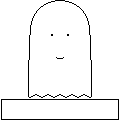

# unari

> Pixel-art ghosts.

* * *

*Entry No. 19 '[ASU-1: Avatar Sized Unari 1](the-entries/019.png)'*

* * *

## In chronological order

- :house: signifies entries that are, or were, header images.
- :pencil2: signifies entries that are minor changes of other entries. (The changed entries' numbers are also noted).

###### Start of list

*Go to [end of list](#end-of-list).*

1. [Original](the-entries/001.png), 2017-10-24
2. [Asleep](the-entries/002.png), 2017-10-24
3. [Tea](the-entries/003.png), 2017-10-25
4. [Thinking](the-entries/004.png), 2017-10-26
5. [Tokkuri](the-entries/005.png), 2017-10-31
6. [Online](the-entries/006.gif), 2017-11-01
7. [ASCII](the-entries/007.png), 2017-11-09
8. [House](the-entries/008.png), 2017-11-09 :house:
9. [Star](the-entries/009.png), 2017-11-17
10. [Desktop](the-entries/010.gif), 2017-12-14
11. [Scalable Vector Ghost](the-entries/011.svg), 2017-12-18
12. [Portable Network Ghost](the-entries/012.png), 2017-12-18 :house: :pencil2: 11
13. [Ghost Interchange Format](the-entries/013.gif), 2017-12-18 :pencil2: 11
14. [Portable Network Ghost 2](the-entries/014.png), 2017-12-23 :pencil2: 12
15. [Ghost Interchange Format 2](the-entries/015.gif), 2017-12-23 :pencil2: 13
16. [Very Long](the-entries/016.png), 2017-12-24
17. [Unarimochi](the-entries/017.png), 2018-01-01 :house:
18. [Starry Hat](the-entries/018.png), 2018-02-01 :house:
19. [ASU-1: Avatar Sized Unari 1](the-entries/019.png), 2018-04-26 :house:
20. [ASU-1 Thinking](the-entries/020.png), 2018-04-26

###### End of list

*Go to [start of list](#start-of-list).*

* * *

## Bonus content

- [Some entries in the list are upscaled from smaller versions](bonus/downscales).
- For entry No. 5 [Tokkuri](the-entries/005.png): The [server](bonus/005-server.png) and the [cup](bonus/005-cup.png).
- For entry No. 9 [Star](the-entries/009.png): The [star](bonus/009-star.png).
- For entry No. 19 [ASU-1](the-entries/019.png): The [Avatar Sized Unari](bonus/019-unari.png) themself.

## Maintainer

- Andrew Zyabin - @schas002 - <https://schas002.github.io>

## Contribute

I'm eagerly awaiting new unari. There's been a shortage of them, and I'd like to encourage diversity. :-)

Every contributor to unari is to follow our code of conduct, which is: don't be rude.

[Link to GitHub](https://github.com/schas002/unari), if you're coming from the GitHub Pages page.

## License

* This work is licensed under the <a rel="license" href="http://creativecommons.org/licenses/by/4.0/">Creative Commons Attribution 4.0 International License</a>.*
