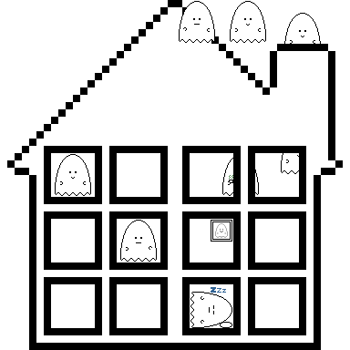

# unari

> Pixel-art ghosts.

* * *

*Entry No. 8 '[House](the-entries/008.png)'*

* * *

No, they aren't scary. They're rather nice.

## In chronological order

<a id="start-of-list">

*Go to [end of list](#end-of-list), **below which is the license**.*

</a>

* * *

1. [Original](the-entries/001.png), 2017-10-24
2. [Asleep](the-entries/002.png), 2017-10-24
3. [Tea](the-entries/003.png), 2017-10-25
4. [Thinking](the-entries/004.png), 2017-10-26
5. [Tokkuri](the-entries/005.png), 2017-10-31
6. [Online](the-entries/006.gif), 2017-11-01
7. [ASCII](the-entries/007.png), 2017-11-09
8. [House](the-entries/008.png), 2017-11-09
9. [Star](the-entries/009.png), 2017-11-17
10. [Desktop](the-entries/010.gif), 2017-12-14

* * *

11. [Scalable Vector Ghost](the-entries/011.svg), 2017-12-18
12. [Portable Network Ghost](the-entries/012.png), 2017-12-18
13. [Ghost Interchange Format](the-entries/013.gif), 2017-12-18

* * *

<a id="end-of-list">

*Go to [start of list](#start-of-list).*

</a>

## Bonus content

- Most entries in the list are upscaled. [See the downscales of those which were](bonus/downscales).
- For entry No. 5 [Tokkuri](the-entries/005.png): The [server](bonus/005-server.png) and [cup](bonus/005-cup.png).
- For entry No. 9 [Star](the-entries/009.png): The [star](bonus/009-star.png).

## License

* This work is licensed under a <a rel="license" href="http://creativecommons.org/licenses/by/4.0/">Creative Commons Attribution 4.0 International License</a>.*
